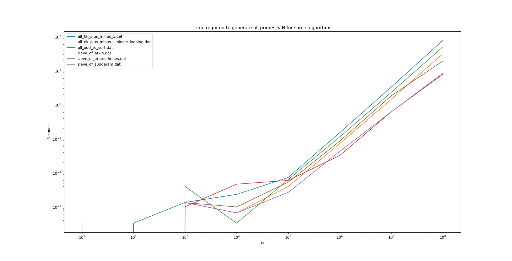

A benchmarking tool for various prime generation algorithms.

The algorithms are measured for execution time and peak memory usage.

All algorithms generate a set of all primes smaller than N.

Two different values for N is being utilized: 107 and 108.

All algorithms need to pass a number of unit tests, to ensure correctness.

The language being used is Python3.

Below is an illustration of the execution times on an Intel Core i-7 8550U CPU, using PyPy 3.6.1 32 bit on Windows 10:

